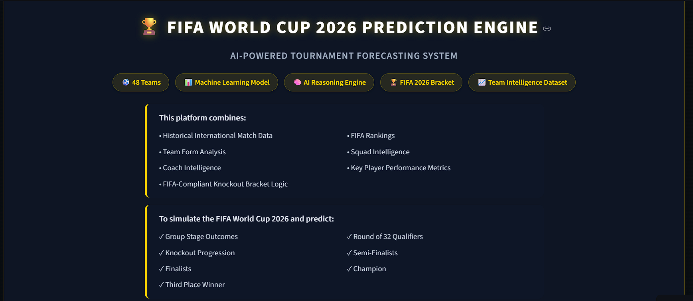
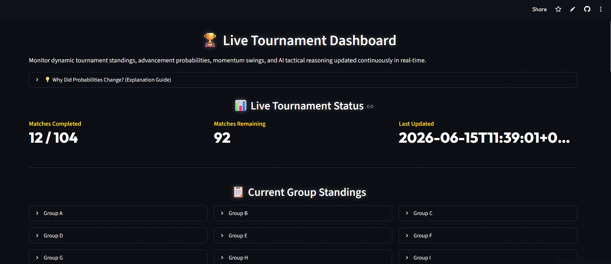
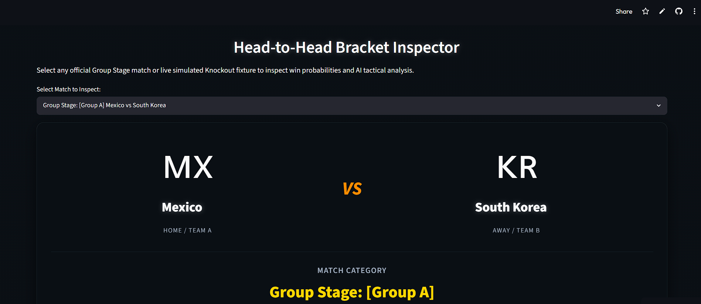

# FIFA World Cup 2026 Prediction Engine

A machine learning-powered FIFA World Cup 2026 forecasting platform that simulates the entire tournament, predicts match outcomes, estimates championship probabilities, and dynamically recalibrates predictions as real tournament results are played.

## Features

### Tournament Simulation

* Full FIFA World Cup 2026 tournament simulation
* Group stage, Round of 32, Round of 16, Quarterfinals, Semifinals, Third-Place Playoff, and Final
* FIFA-compliant knockout bracket logic
* Official Annex C third-place qualification mappings (495 combinations)

### Machine Learning Match Prediction

* Logistic Regression based prediction model
* Historical international football results used for training
* FIFA ranking integration
* Team form and quality-weighted performance metrics

### Live Tournament Recalibration

* Automatically updates probabilities as real World Cup matches are completed
* Dynamic group standings
* Qualification probability tracking
* Championship probability updates
* Most likely knockout opponents

### Interactive Dashboard

* Tournament simulator
* Head-to-head match predictor
* Live World Cup dashboard
* Group qualification probabilities
* Championship probability rankings
* Tournament structure validation tools

## Technical Highlights

* Python
* Streamlit
* Pandas
* NumPy
* Scikit-learn
* Monte Carlo Simulation
* FIFA World Cup 2026 Tournament Modeling

## Performance

| Metric                       | Result         |
| ---------------------------- | -------------- |
| Initial App Load             | ~1.5 seconds   |
| Head-to-Head Prediction      | < 0.01 seconds |
| Group Standings Calculation  | ~0.002 seconds |
| 1,000 Tournament Simulations | ~2.6 seconds   |

## Validation & Auditing

The system includes multiple verification layers:

* Team name consistency audit
* FIFA ranking lookup validation
* Group allocation validation
* Fixture integrity validation
* Annex C knockout structure validation
* Live results ingestion validation
* Probability movement auditing

## Project Structure

```text
World-Cup-2026-Prediction/
│
├── data/
│   ├── results.csv
│   ├── fifa_ranking-2024-06-20.csv
│   ├── world_cup_2026_live_results.json
│   └── world_cup_2026_baseline_probabilities.json
│
├── py_files/
│   ├── app.py
│   ├── preprocess.py
│   ├── tournament_simulator.py
│   ├── live_results_manager.py
│   ├── probability_audit.py
│   └── transparency_explainer.py
│
├── screenshots/
│   ├── head_to_head.png
│   ├── simulator.png
│   └── live_dashboard.png
│
├── README.md
├── requirements.txt
└── .gitignore

## Live Application

Experience the application live:

https://world-cup-2026-prediction.streamlit.app


## Screenshots

### Tournament Simulator



### Live Tournament Dashboard



### Head-to-Head Predictor



## Author

Muhammed Savad

Data Science Student | Machine Learning Enthusiast | Football Analytics
